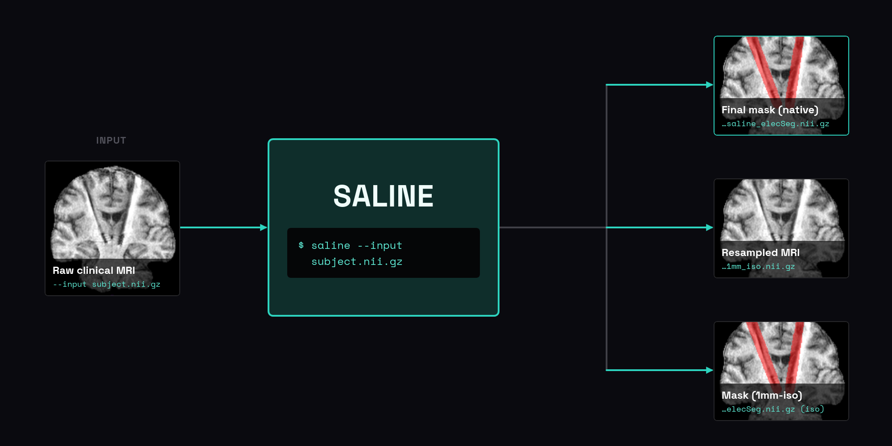

# SALINE (part of DBS-ElecNet) [](https://github.com/srikash/SALINE/releases/tag/v0.3.1) [](LICENSE) [](https://github.com/srikash/SALINE/actions/workflows/release.yml) [](https://doi.org/10.5281/zenodo.23166358)

## <b><ins>S</ins></b>egmentation <b><ins>A</ins></b>lgorithm using <b><ins>LIN</ins></b>e-fitting for <b><ins>E</ins></b>lectrodes

*V. H. Yu et al., "DBS-ElecNet: Automated Localization and Segmentation of DBS Electrodes in Clinical MRI," 2026 IEEE 23rd International Symposium on Biomedical Imaging (ISBI), London, United Kingdom, 2026, pp. 1-4, doi:[10.1109/ISBI61048.2026.11515562](https://doi.org/10.1109/ISBI61048.2026.11515562)*

Give SALINE a raw clinical T1-weighted MR image and get a segmentation
back. It runs as a fully standalone CLI tool.

It is the core of [DBS-ElecNet](https://github.com/BRAIN-TO/DBS-ElecNet)'s 
classical (non-deep-learning) segmentation pipeline.



## Table of Contents

- [Why SALINE?](#why-saline)
- [Install](#install)
- [Usage](#usage)
- [Citation](#citation)
- [Contributors](#contributors)

## Why SALINE?

SALINE is a classical, filtering-based automatic segmentation method for DBS
electrodes: no training, no manual annotation, no GPU. See the paper above
for how the pipeline works.

That makes it well suited to building a large labeled dataset without
manual annotation, exactly how DBS-ElecNet's own training data was produced.

## Install

SALINE is two separate things: the Python package, and the imaging tools
it calls out to (SynthStrip, SynthSeg, ANTs). `pip install` only gives you
the first. The tools are not Python dependencies and don't come with it.

**1. Create an environment and install the Python package**

Requires Python 3.12+.

Pure Python:

```bash
python3.12 -m venv .venv
source .venv/bin/activate
pip install saline-dbs
```

conda / mamba:

```bash
conda create -n saline python=3.12
conda activate saline
pip install saline-dbs
```

(substitute `mamba` for `conda` throughout if that's what you use)

This installs the `saline` CLI and its Python dependencies.

**2. Install Docker (recommended)**

Install [Docker](https://www.docker.com) and make sure it's running.
SALINE pulls the images it needs automatically the first time it runs.
There's nothing to install yourself beyond Docker itself:

* [`freesurfer/synthstrip`](https://hub.docker.com/r/freesurfer/synthstrip)
* [`cookpa/synthseg`](https://hub.docker.com/r/cookpa/synthseg)
* [`antsx/ants`](https://hub.docker.com/r/antsx/ants)

With Docker running, `saline --input subject.nii.gz` works end to end.

**Running without Docker**

If Docker isn't available:

* SynthStrip and SynthSeg have no local fallback. Pass precomputed files
  instead: `--brain_mask PATH` and `--synthseg PATH`, already in the same
  1mm-isotropic space SALINE would otherwise resample `--input` into.
* ANTs falls back to a local install: `ResampleImage`,
  `N4BiasFieldCorrection`, and `ImageMath` on `PATH`.

## Usage

Dual-electrode (default, also available explicitly as `saline dual`):

```bash
saline --input subject.nii.gz
```

Single-electrode:

```bash
saline single --input subject.nii.gz
```

`--input` is a raw, native-space clinical MRI; SALINE handles the rest.
See [Install](#install) for what that needs and how to run without Docker.

**Output:**

* `subject_saline_elecSeg.nii.gz`: the electrode segmentation, in `--input`'s native space.
* `subject_1mm_iso.nii.gz`: the resampled MRI, kept for reference.
* `subject_1mm_iso_saline_elecSeg.nii.gz`: the electrode segmentation, in 1mm-isotropic space.

**Optional arguments:**

* `--threads` (default `5`): threads for SynthSeg.
* `--laplacian_threshold` (default `0.21`)
* `--frangi_threshold` (default `0.25`)
* `--lower_frangi_threshold` (default `0.2`): used if the higher threshold finds no candidates.
* `--expand_radius` (default `6`): dilation radius applied to the final line mask.
* `--save_intermediate`: also save the thresholded Laplacian, Frangi, and combined masks.

## Citation

If you use this in your work, please cite the paper above (see [`CITATION.cff`](CITATION.cff)
for the full machine-readable record).

## Contributors

[Vanessa H. Yu](https://github.com/ttyhhu) and [Sriranga Kashyap](https://github.com/srikash)
